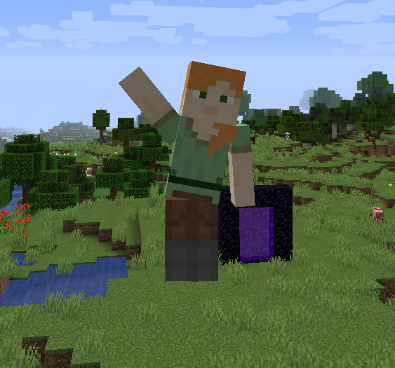

## Эмоции персонажа

Обязательно нужно установить мод - [Emotecraft](https://modrinth.com/plugin/emotecraft/versions?l=fabric)

Персонаж может проигрывать анимации (танцы, приветствия, жесты, позы) — чисто визуально, на геймплей не влияет.

1. Откройте **колесо эмоций** горячей клавишей.
2. Выберите анимацию курсором.
3. Часть эмоций одноразовые, часть — зацикленные (сбиваются движением или боем).

> Часто используемые эмоции можно вынести в **быстрые слоты** через настройки, чтобы запускать без колеса.

Видно всем игрокам поблизости. Если анимации не отображаются — проверьте, установлен ли нужный клиентский мод.
