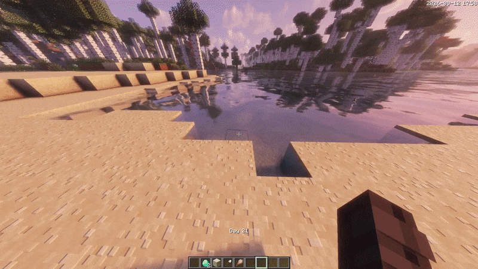

Любой игрок может закопать **любой предмет** в песок и получить **подозрительный песок**, при раскопке которого (кистью) появится именно закопанный предмет.

### Как закопать предмет

1. Возьмите предмет, который хотите закопать, в **левую руку** (off-hand).
2. Возьмите **лопату** в правую руку.
3. Наведитесь на песок и **зажмите ПКМ**.

> Получившийся подозрительный песок выглядит как обычный и не отличается от других — узнать содержимое можно только раскопав его кистью.

### Демонстрация

