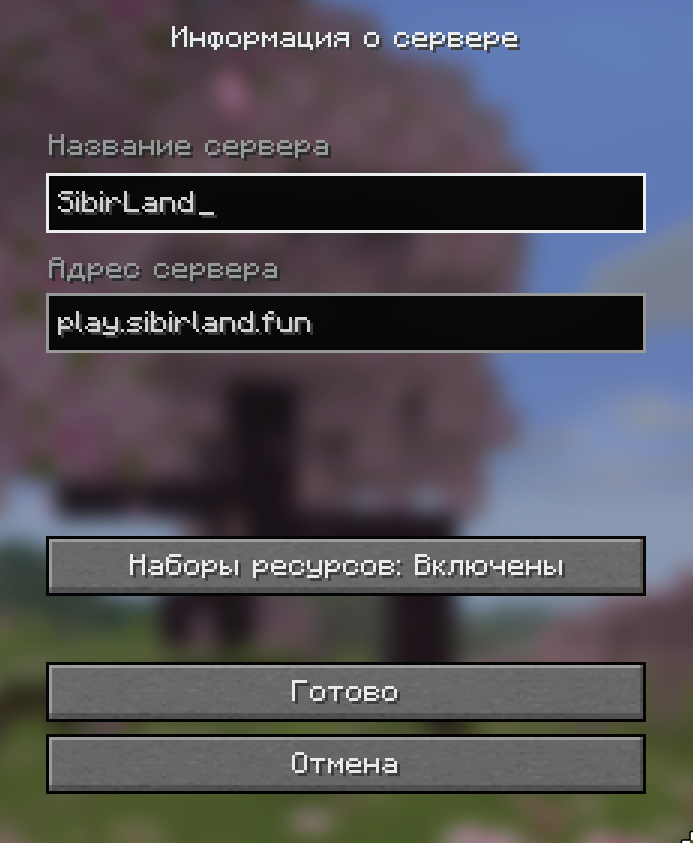

### Как начать играть на проекте SibirLand

Перед началом обязательно прочитайте [Правила](https://wiki.sibirland.fun/#/rules.

### Первое — с чего начать?

1. Подать заявку через бота [@SibiWhitelist_bot](https://t.me/SibiWhitelist_bot).
2. Зайти в чат по ссылке полученой от бота (если заявку одобрили)

### Второе — как зайти?

1. Найти нужную версию можно в том же Telegram-канале, к которому вы присоединились.
2. Запустите игру нужной версии и добавьте сервер в список серверов.

### Команды авторизации

<table>
    <thead>
    <tr>
        <th>Команда</th>
        <th>Назначение</th>
    </tr>
    </thead>
    <tbody>
    <tr>
        <td><code>/register</code></td>
        <td>Регистрация аккаунта</td>
    </tr>
    <tr>
        <td><code>/login</code></td>
        <td>Вход в аккаунт</td>
    </tr>
    </tbody>
</table>

3. Вас перекинет на сервер, где уже можно играть.
4. Если пишет, что вас нет в вайтлисте (белом списке) — прочитайте начало этой инструкции.

### Приятной игры! 🎮
