## Шаблоны(Тримы) брони

Тримы (узоры) брони — это косметическая (а на некоторых серверах не только косметическая) настройка внешнего вида доспехов с помощью **шаблонов тримов** (smithing templates) и **кузнечного стола**.

Каждый шаблон трима находится в определённой структуре мира (крепости, деревни, храмы, руины и так далее) и связан с определённым материалом и узором. Найденный шаблон можно применить к броне один раз, но чтобы использовать его снова — обычно требуется его размножить.

## Крафты дублирования

На сервере у вас есть возможность делать дубликаты шаблонов, крафты представлены ниже:

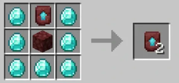

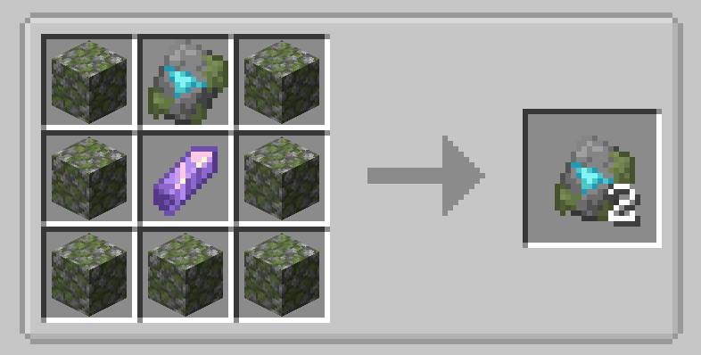

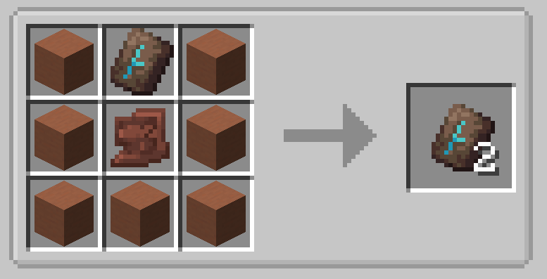

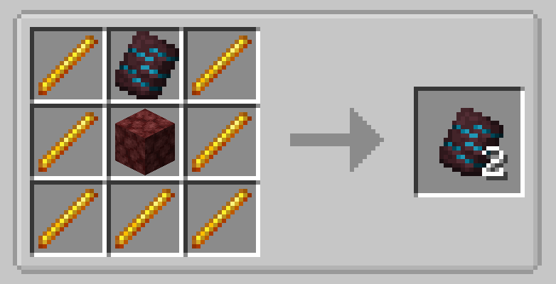

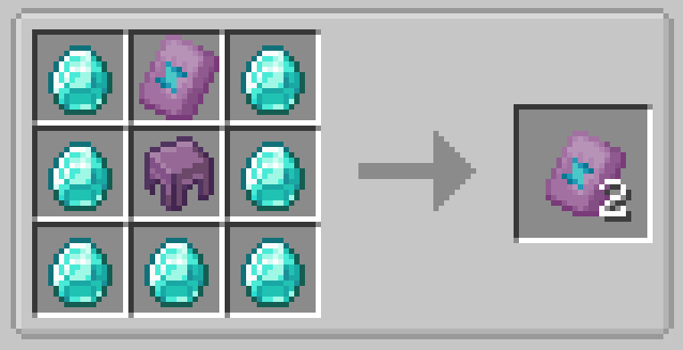

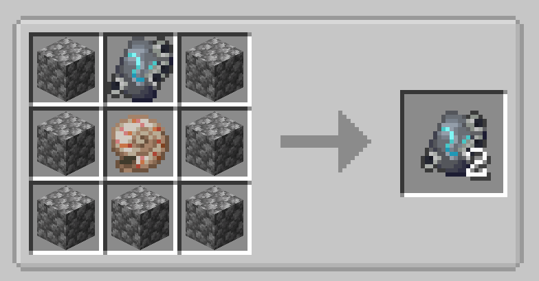

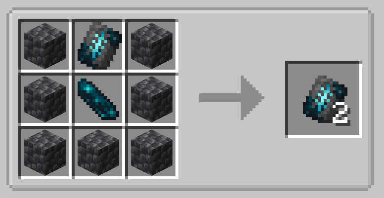

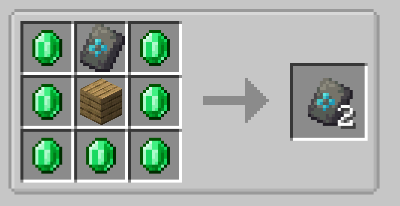

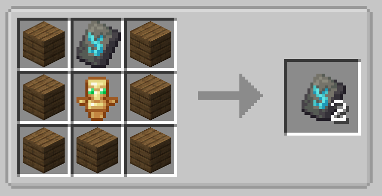

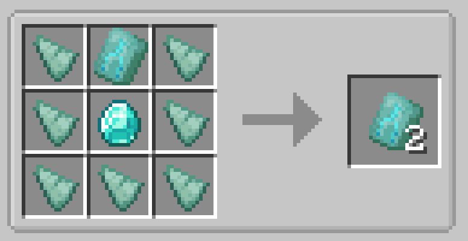

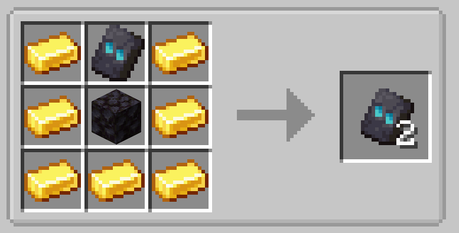

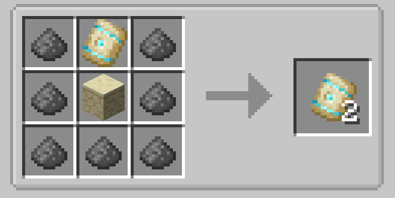

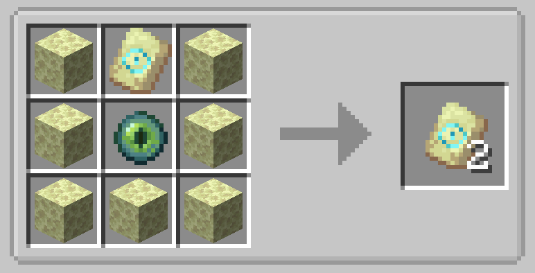

