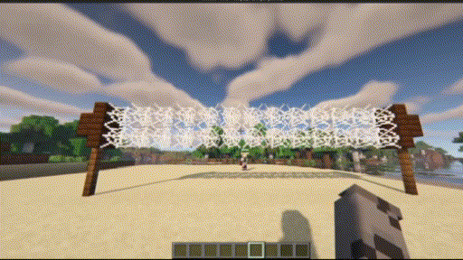

Мини-игра с мячом, в которую можно поиграть с другими игроками.

### Крафт мяча

Мяч создаётся из 8 единиц кожи и нажатию кожей по живому иглобрюху.

### Управление

- **ПКМ** — подобрать мяч.
- **ЛКМ** — бросить мяч.
- **Зажать Shift** — во время удержания появляется **шкала силы удара**: чем дольше держите — тем сильнее и дальше полетит мяч. Нажмите ЛКМ, чтобы выполнить удар с накопленной силой.

> Мяч можно перебрасывать между игроками через сетку, как в обычном волейболе — если мяч коснётся земли на вашей стороне, очко уходит сопернику.

### Демонстрация

